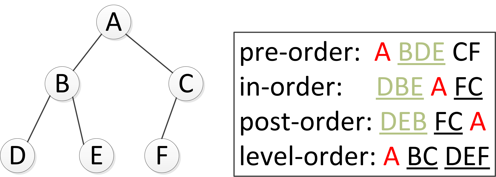

# 94. Binary Tree Inorder Traversal

## Recursive Approach

二叉树中序遍历，先处理左子树，再处理根节点，最后再处理右子树。递归实现版本。

Time complexity: O(N)

Space complexity: O(H), where H is the height of binary tree.

```java
public class Solution {
  public List<Integer> inOrder(TreeNode root) {
    // Write your solution here
    List<Integer> result = new ArrayList<>();
    inOrder(root,result);
    return result;
  }
  public void inOrder(TreeNode root, List<Integer> result){
    //base case
    if (root == null){
      return;
    }
     inOrder(root.left,result);
     result.add(root.key);
     inOrder(root.right,result);
  }
}
```

## Iterative Approach

迭代实现。

由于中序遍历是先处理左子树，再访问根节点，最后处理右子树，这里我们依然用栈来实现。总体思想是，在处理一个新节点的时候先不断地向下找左孩子找到null为止，然后依次弹出处理。每处理一个节点之后，处理它的右孩子，对于右孩子的处理遵循着同样的思想。

举个例子，如下图二叉树，


因为要先处理左子树，所以我们首先沿着`root`一路访问左孩子，直到左孩子是null位为止。此时栈里压满了沿着`root`一路向左的节点，`[A->B->D]`。从栈顶弹出`D`之后，加入答案，此时检查一下D有没有右子树。没有，所以弹出`B`，加入答案之后，发现`B`确实有右孩子，这样就把`E`压入栈中。此时栈是`[A->E]`。

从栈里弹出`E`处理完之后，发现`E`并没有右孩子。弹出`A`，处理完之后发现`A`有右孩子，压入`C`和`F`。此时栈是`[C->F]`。弹出`F`，加入答案后发现`F`没有右孩子。弹出`C`加入答案后，发现`C`没有右孩子。栈为空，中序遍历结束。

Time complexity: O(N)

Space complexity: O(H), where H is the height.

```java
public class Solution {
  public List<Integer> inOrder(TreeNode root) {
    // Write your solution here
     List<Integer> result = new ArrayList<>();
     Deque<TreeNode> stack = new ArrayDeque<>();
     while(root != null || !stack.isEmpty()){
          if(root != null){
            stack.push(root);
            root = root.left;
          }
          else{
            root = stack.pop();
            result.add(root.key);
            root = root.right;
          }
     }
     return result;
  }
}

```