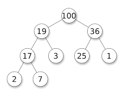

# Heap

## Basics

这次讲堆的专题，堆(Heap)是一种类似二叉树的数据结构，有根节点，除了根节点外所有节点都有父节点。而且这个二叉树满足以下性质，
+ 它是完全二叉树，complete binary tree。
+ 根据不同的堆的类型，保持一定的堆序。对于大顶堆(Max Heap)来说，任意节点都大于它的子节点。对于小顶堆来说，任意节点都小于它的子节点。

如下图，这是一个大顶堆。我们可以看到，对于任意的节点，它都大于它的子节点。



因为堆满足完全二叉树这一特性，所以我们可以用数组来盛放该数据结构，而不用真的用二叉树来实现。

## Operation

一般情况下，我们要用到堆的操作无非以下几个
+ `offer`，往堆里添加新元素，并保持堆序性
+ `poll`，从堆顶弹出元素并返回，同时保持堆序性
+ `peek`，返回堆顶元素，并不弹出
+ `size`，返回堆中目前有多少个元素

以上操作具体实现代码我贴在最后，原理可以在算法红书上找到(2.4)。我们这里着重分析一下`offer`和`poll`的时间复杂度。

假设堆内有N个元素，加入新元素的话，因为需要不断地向上swim，所以复杂度是logN。同样，弹出堆顶元素需要把堆尾的元素拿来替换堆顶，然后让它重新沉下去，所以复杂度依然是logN。

## Scenario

堆的使用场景一般有哪些呢？总的来说，如果你需要得到一堆数据里最小/最大的一部分，这时候往往需要用到堆。比如，
+ 一堆数据里最大的K个数
+ 一堆数求中位数
+ 优先队列

## Implementation

```java
public class MaxHeap {
  private int[] array;
  private int count = 0;

  MaxHeap(int size) {
    this.array = new int[size + 1]; // use [1, size] with 0 unused
  }

  public int getCount() {
    return count;
  }

  public int peek() {
    return array[1];
  }

  public void offer(int num) {
    array[++count] = num;
    swim(count);
  }

  public int poll() {
    int res = array[1];
    swap(array, 1, count--);
    array[count + 1] = Integer.MIN_VALUE;
    sink(1);
    return res;
  }

  private void sink(int k) {
    while (k * 2 <= count) {
      int cIdx = k * 2;
      if (cIdx < count && array[cIdx] < array[cIdx + 1]) {
        // choose the greater child
        cIdx++;
      }
      if (array[k] > array[cIdx]) {
        // k is already greater than the bigger child
        break;
      }
      swap(array, k, cIdx);
      k = cIdx;
    }
  }

  private void swim(int k) {
    while (k > 1 && array[k] > array[k / 2]) {
      swap(array, k, k / 2);
      k = k / 2;
    }
  }

  private void swap(int[] array, int i, int j) {
    int temp = array[i];
    array[i] = array[j];
    array[j] = temp;
  }
}
```